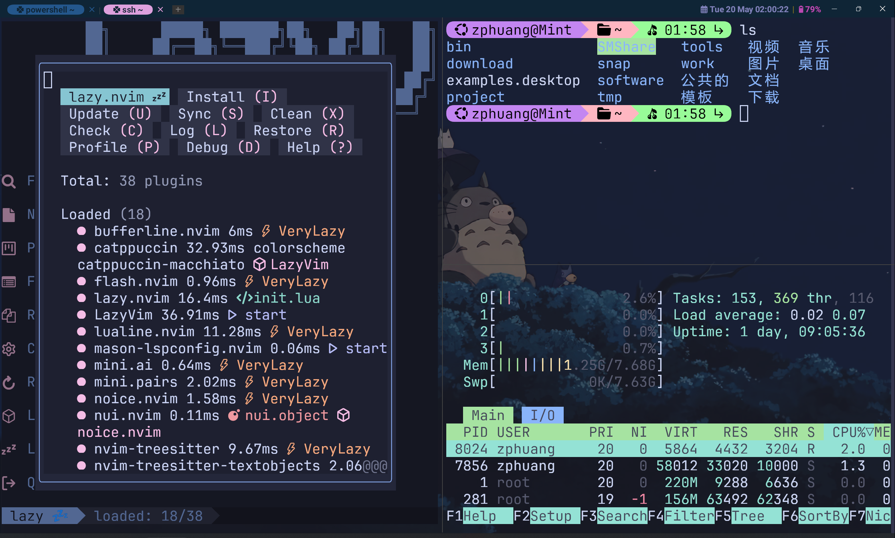
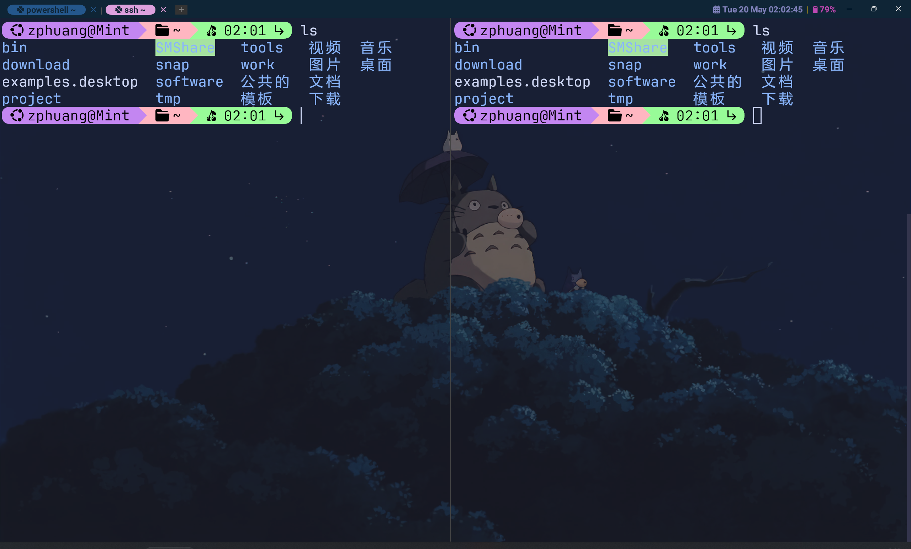
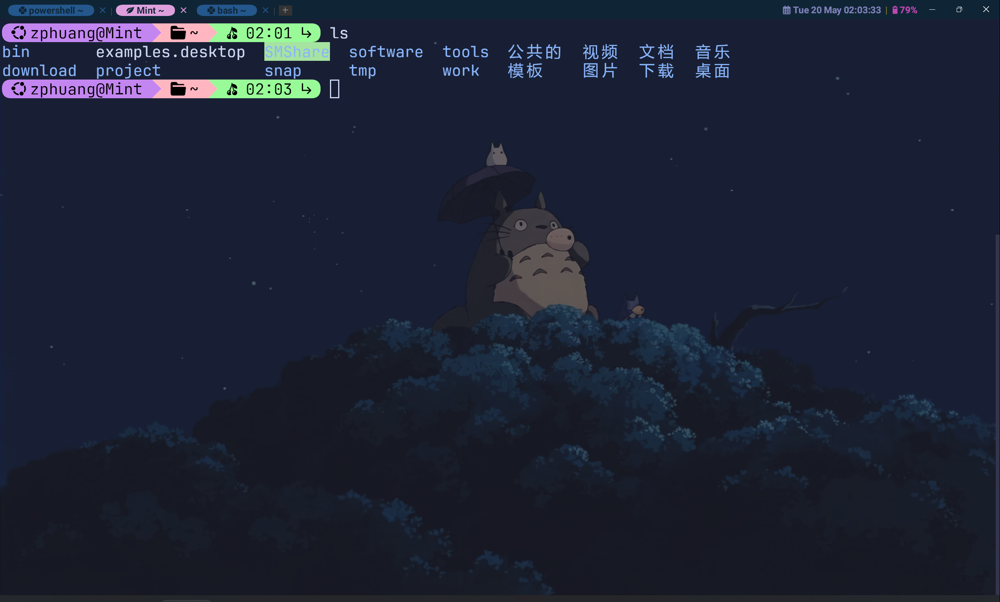

A GPU-accelerated cross-platform terminal emulator and multiplexer written by <a href="https://github.com/wez">@wez</a> and implemented in <a href="https://www.rust-lang.org">Rust</a>

User facing docs and guide at: <a style="font-weight: bold;" href="https://wezterm.org">wezterm.org</a>

##                                  My WezTerm Config

**The configuration of the wezterm.**

### Overview

**screenshot1**

**screenshot2**

**screenshot3**

### Requirements

- A wezterm terminal emulator
- A Nerd Font

### Usage

1. Install wezterm

[WezTerm终端](https://github.com/wezterm/wezterm/releases)

2. Install NerdFont

Download the corresponding font from the [NerdFont official website](https://www.nerdfonts.com/cheat-sheet)

**Recommended fonts**

[MesloLGM Nerd Font](https://github.com/ryanoasis/nerd-fonts/blob/v3.2.1/patched-fonts/Meslo/M/Regular/MesloLGMNerdFont-Regular.ttf)

[JetBrainsMono NF](https://github.com/ryanoasis/nerd-fonts/blob/v3.2.1/patched-fonts/JetBrainsMono/Ligatures/Regular/JetBrainsMonoNerdFont-Regular.ttf)

> [!CAUTION]
>
> Version>=v3.2.1. The font version must be matched with the icon; otherwise, strange garbled characters will appear.

3. Download this repository and uncompress the package.

4. Place the decompressed files in the designated path.

> Linux Path: `$HOME/.config/wezterm`
>
> Windows Path: `C:\Users\SHIERYUE\.config\wezterm`

### Keymaps

|      Key      |      Description       |
| :-----------: | :--------------------: |
| Ctrl+Shift+c  |          复制          |
| Ctrl+Shift+v  |          粘贴          |
| Ctrl+Shift+r  |      重命名标签栏      |
| Ctrl+Alt+[\\] | 水平拆分窗格(左右拆分) |
| Ctrl+Alt+[-]  | 垂直拆分窗格(上下拆分) |
| Ctrl+Alt+[/]  |      关闭当前窗格      |
|  Ctrl+Alt+z   | 最大化/最小化当前窗格  |
|      F11      |          全屏          |
| Ctrl+Alt+[↑]  |      向上扩展窗格      |
| Ctrl+Alt+[↓]  |      向下扩展窗格      |
| Ctrl+Alt+[←]  |      向左扩展窗格      |
| Ctrl+Alt+[→]  |      向右扩展窗格      |
|    Alt+[↑]    |        放大字体        |
|    Alt+[↓]    |        缩小字体        |
|     Alt+r     |      重置字体大小      |

### Reference

- <https://github.com/rxi/lume>
- <https://github.com/catppuccin/wezterm>
- <https://github.com/wezterm/wezterm/discussions/628#discussioncomment-1874614>
- <https://github.com/wezterm/wezterm/discussions/628#discussioncomment-5942139>
- <https://github.com/wezterm/wezterm/discussions/628#discussioncomment-3649195>
- <https://github.com/QianSong1/wezterm-config>
- <https://github.com/KevinSilvester/wezterm-config>

🎈🎈🎈🎈🎈🎈🎈🎈🎈🎈🎈🎈🎈🎈🎈🎈🎈🎈🎈🎈🎈🎈🎈🎈🎈🎈🎈🎈🎈🎈🎈🎈🎈🎈🎈

**Now, Please Enjoy it!**

💐💐💐💐💐💐💐💐💐💐💐💐💐💐💐💐💐💐💐💐💐💐💐💐💐💐💐💐💐💐💐💐💐💐💐

